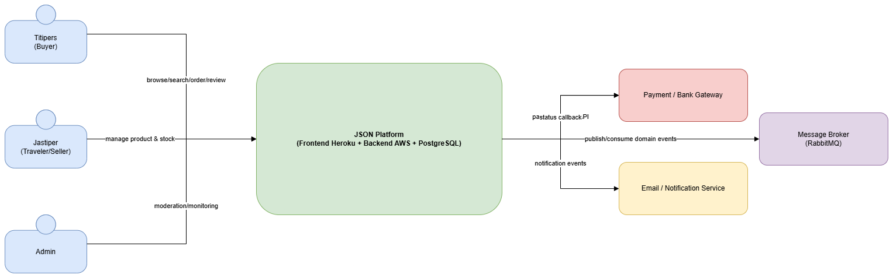
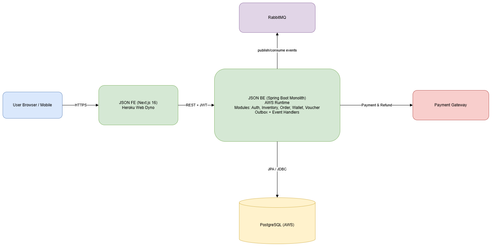
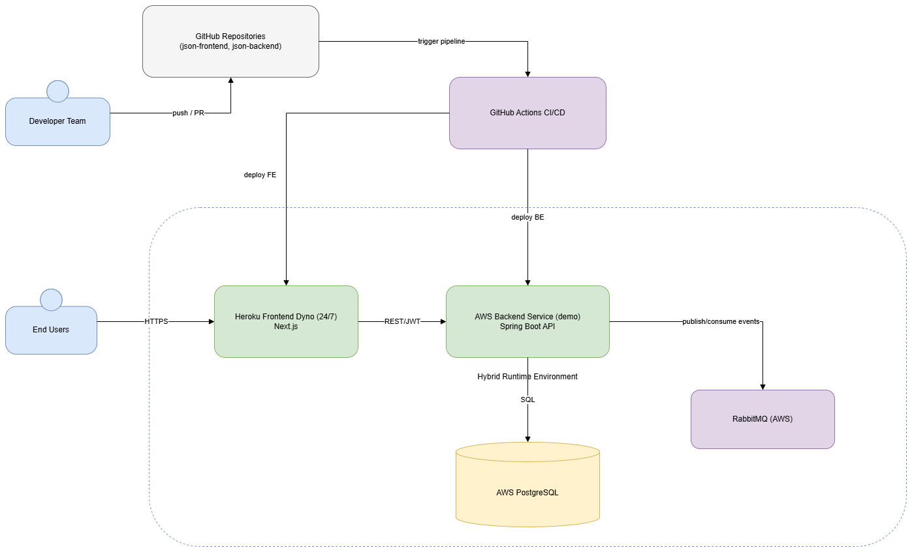
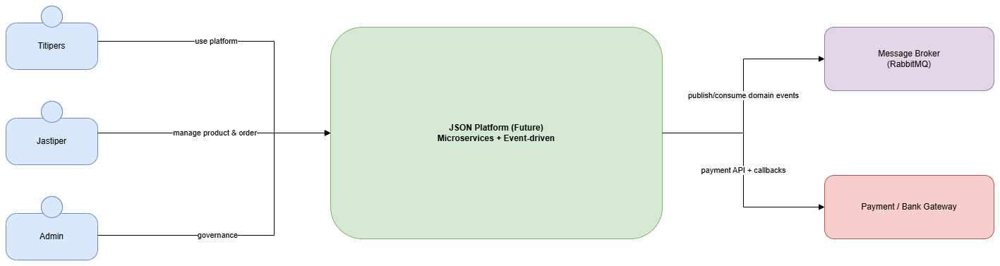
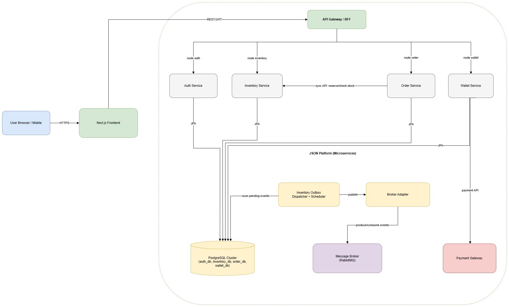
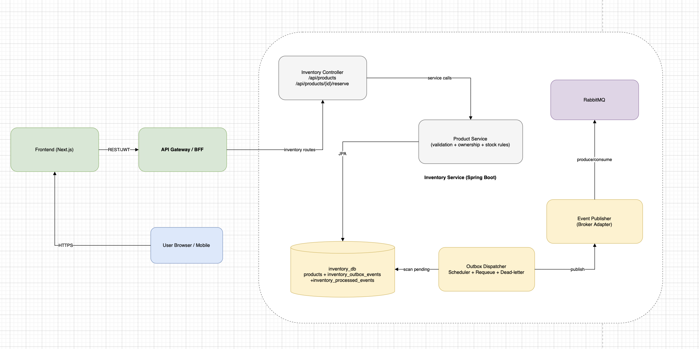
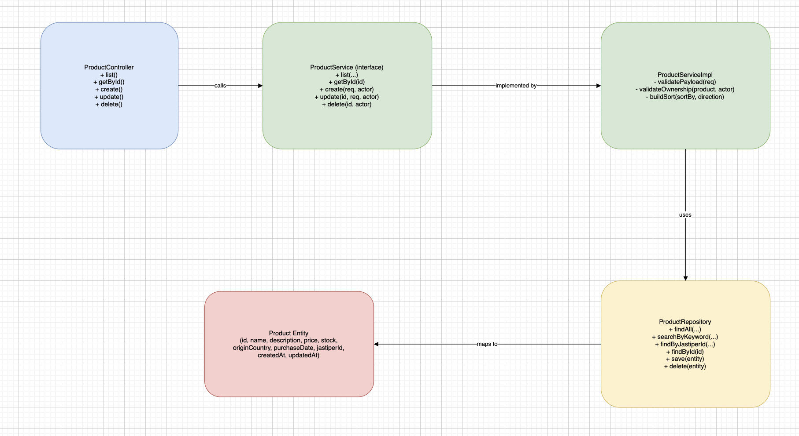
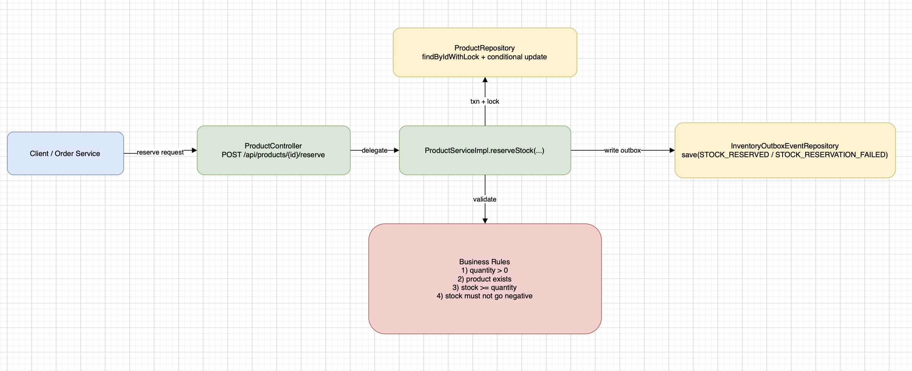
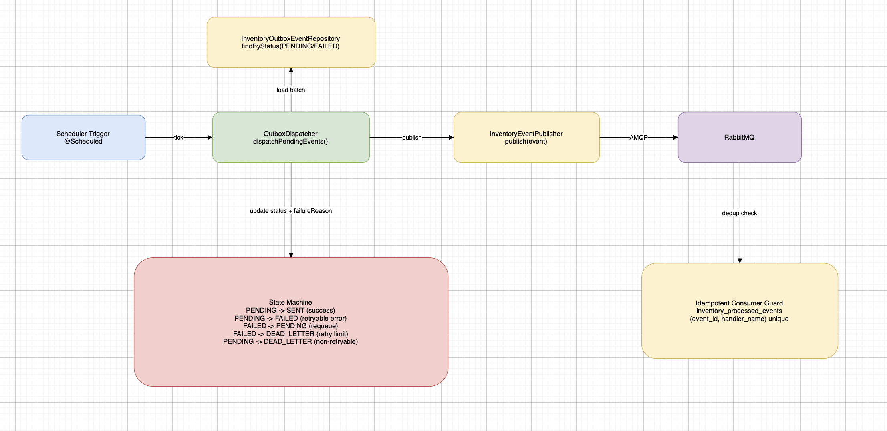

# Advanced Programming A16 - JSON

## Group Architecture - Current State

### Context Diagram (Current)
Current context menunjukkan tiga aktor utama: Titipers, Jastiper, dan Admin yang berinteraksi dengan JSON Platform.  
Titipers menggunakan platform untuk browse/search/order/review, Jastiper mengelola katalog dan stok, sedangkan Admin melakukan moderasi dan monitoring.  
Platform juga terhubung ke sistem eksternal untuk payment/bank callback, notifikasi, dan message broker (RabbitMQ) untuk event domain.

### Container Diagram (Current)
Current container menunjukkan alur utama dari user ke frontend Next.js di Heroku, lalu diteruskan ke backend Spring Boot API.  
Backend menangani modul Auth, Inventory, Order, dan Wallet, lalu berinteraksi dengan PostgreSQL serta payment gateway.  
Pada tahap ini, arsitektur current sudah mengadopsi event-driven untuk alur integrasi domain secara menyeluruh dan komunikasi event async berjalan melalui RabbitMQ sehingga event domain (misalnya reserve/release stock) bisa diproses lintas flow tanpa coupling ketat.

### Deployment Diagram (Current)
Current deployment menggunakan CI/CD GitHub Actions dari repository frontend dan backend.  
Frontend di-deploy ke Heroku, backend service berjalan di AWS runtime, database di AWS PostgreSQL, dan broker event di RabbitMQ (AWS).  
Diagram ini memperlihatkan alur deploy FE/BE, akses end-user via HTTPS, serta integrasi runtime antar komponen produksi/staging.

---

## Group Architecture - Future State

### Context Diagram (Future)
Future context mengarah ke arsitektur microservices + event-driven.  
Aktor bisnis tetap sama, tetapi core platform dipisah ke service-service domain yang berkomunikasi melalui API gateway (sync) dan event broker (async).  
Tujuan perubahan ini adalah menurunkan coupling antar domain dan meningkatkan ketahanan saat traffic meningkat.

### Container Diagram (Future)
Future container memperkenalkan API Gateway/BFF di depan beberapa service domain (Auth, Inventory, Order, Wallet).  
Setiap service memiliki batas domain yang jelas, komunikasi sinkron untuk kebutuhan langsung (contoh reserve/check stock), dan komunikasi asinkron via RabbitMQ untuk event lintas domain.  
Pola outbox + idempotency dipertahankan agar event processing tetap konsisten dan aman terhadap duplikasi.

---

## Risk Storming and Architecture Modification Justification

Arsitektur awal memiliki risiko utama pada bottleneck pemrosesan backend dan tingginya blast radius ketika komponen inti mengalami gangguan. Saat beban transaksi naik, satu titik backend berpotensi menjadi hotspot yang memengaruhi flow inventory, order, dan wallet secara bersamaan. Selain itu, alur event bisnis yang semakin kompleks meningkatkan risiko inkonsistensi state bila hanya mengandalkan komunikasi sinkron.

Berdasarkan risk storming, kami memprioritaskan risiko dengan dampak tertinggi: overselling stok saat concurrency tinggi, keterlambatan propagasi status transaksi, serta sulitnya isolasi kegagalan domain. Karena itu, arsitektur diarahkan ke microservices + event-driven agar domain bisa dipisah secara operasional, event bisa diproses asinkron, dan kegagalan satu service tidak langsung memutus seluruh platform.

Perubahan ini memang menambah kompleksitas sistem, terutama pada observability, tracing lintas service, dan konsistensi data antar domain. Trade-off ini diterima karena memberikan fondasi skalabilitas dan reliability yang lebih baik untuk pertumbuhan traffic. Untuk mitigasi, kami menerapkan outbox pattern, idempotent consumer, retry + dead-letter flow, serta contract/API validation antar service agar perubahan tetap terkontrol.

---

## Trade-offs Summary

### Benefits
- Isolasi domain lebih jelas dan maintainability meningkat.
- Skalabilitas lebih fleksibel per service.
- Reliability lebih baik melalui pemrosesan event async.

### Costs
- Kompleksitas deployment dan monitoring meningkat.
- Debugging lintas service lebih sulit.
- Governance kontrak API/event harus lebih ketat.

### Mitigation Plan
- Outbox + idempotency sebagai default event safety.
- Retry policy dan dead-letter queue untuk failure handling.
- Standardisasi observability (log correlation, tracing, metrics).
- Contract-first API/event schema untuk mencegah breaking integration.

---

## Individual Work - Inventory Module

### Individual Container Diagram (Inventory)
Diagram ini menurunkan container level group ke fokus modul Inventory.  
Tujuannya menunjukkan boundary Inventory terhadap komponen eksternal (API layer, database, dan broker) serta alur sinkron dan asinkron yang dipakai.

### Individual Code Diagram 1 - Product CRUD Flow
Diagram ini menunjukkan struktur kode inti untuk use case CRUD produk: controller -> service -> repository -> entity.  
Tujuannya menegaskan layering, pemisahan tanggung jawab, dan jalur eksekusi utama saat create/read/update/delete produk.

### Individual Code Diagram 2 - Reserve Stock Flow
Diagram ini memfokuskan alur reserve stock dengan kontrol konkurensi dan validasi invariant stok.  
Tujuannya memperjelas bagaimana modul Inventory menjaga aturan bisnis `stock >= 0` pada request paralel.

### Individual Code Diagram 3 - Outbox Dispatch Flow
Diagram ini menjelaskan alur event-driven internal Inventory: pencatatan outbox event, dispatcher, retry/dead-letter, dan publish ke broker.  
Tujuannya menunjukkan reliability mechanism agar event processing konsisten dan tahan terhadap kegagalan sementara.

